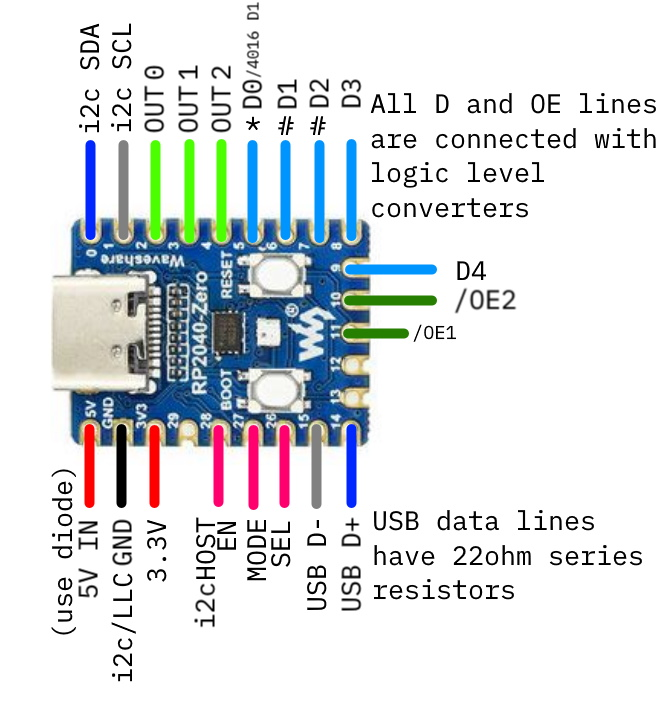

# pico-ps2famikb
Raspberry Pi Pico driven Family Basic Keyboard emulator for PS/2 capable devices and USB through a host

- \* D0 is only needed for subor mouse support. Connecting it will conflict with controller 2, it can be left disconnected
- \# D1 and D2 are only needed for Family Basic Keyboard mode, these can be left disconnected (esp. if making for NES player 2 controller port)
- \? KB and MSE lines are only needed for direct input. These can be left disconnected if only the USB Host will be used (USB Host EN can then be tied to 3.3V to permanently enable it)

