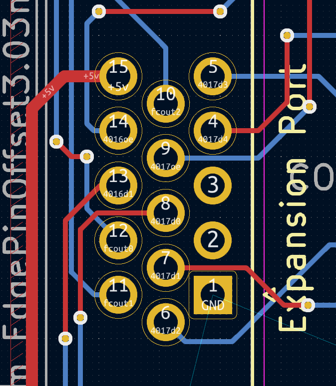
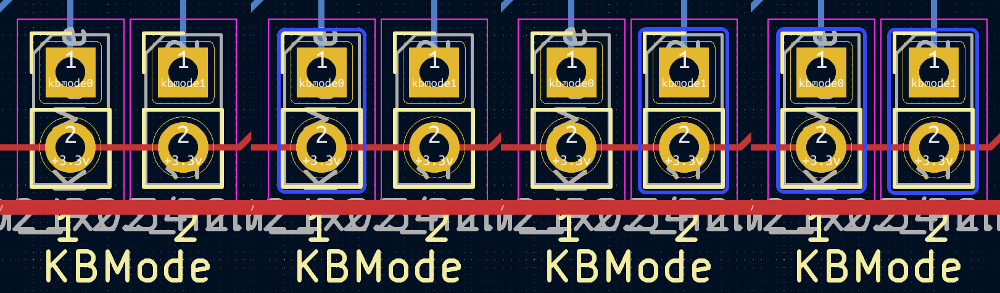
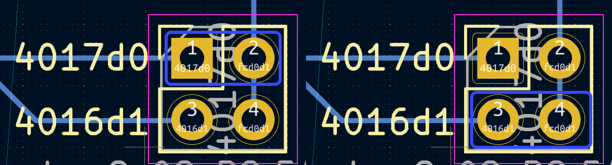

# pico-usb2famikb Reference PCBs
This directory contains reference PCB designs for the pico-usb2famikb. They have not been designed by a experienced engineer, but they DO work.

If you have some experience designing circuits like this, I would very much welcome improved designs.

For the full featured reference design you will need:
* 1x Raspberry Pi Pico
* 1x diode (I am using a 1N5819)
* 1x push button
* 1x 15pin d-sub VGA connector (for expansion port)
* 1x USB A type female port
* 2x 22ohm resistors
* 1x 100uf 16v capacitor (input from console)
* 1x 330uf 16v capacitor
* 2x four-channel logic level converters
* 13x pin headers (and some jumpers)

Note: The 330uf capactior was added because some USB3 hubs seem to draw significant power on startup can could crash the console or Pico, or both. The USB2 hubs I tested don't seem affected, but you can also just plug everything in before you turn on the console to avoid any issues.

## Wiring guide
The expansion port connector is laid out as follows when viewed from the top.

It is wired following the pinout of the [Famicom Expansion Port](https://www.nesdev.org/wiki/Expansion_port), 01 to 01, 15 to 15.
Wiring for the NES is more complicated, please reference both the tables on that page for wiring.

## Jumper guide
### KB Mode
The pico-usb2famikb can operate in four different modes:
 - Keyboard Mouse Host
 - Family Basic Keyboard
 - Subor Keyboard and Mouse
 - Family Basic Keyboard and HoriTrack

These modes are selected by setting the KBMode jumpers before power on (or reset).

 - No jumpers = Keyboard Mouse Host
 - One jumper on KBMode 1 = Family Basic Keyboard
 - One jumper on KBMode 2 = Subor Keyboard and Mouse
 - Two jumpers on KBMode 1 and 2 = Family Basic Keyboard and HoriTrack
 

### 4016D1/4017D0
HoriTrack and Subor Mouse require an extra data line which may interfere with controllers if left permanantly connected.

 - 4017d0 for Subor Mouse
 - 4016d1 for HoriTrack
 