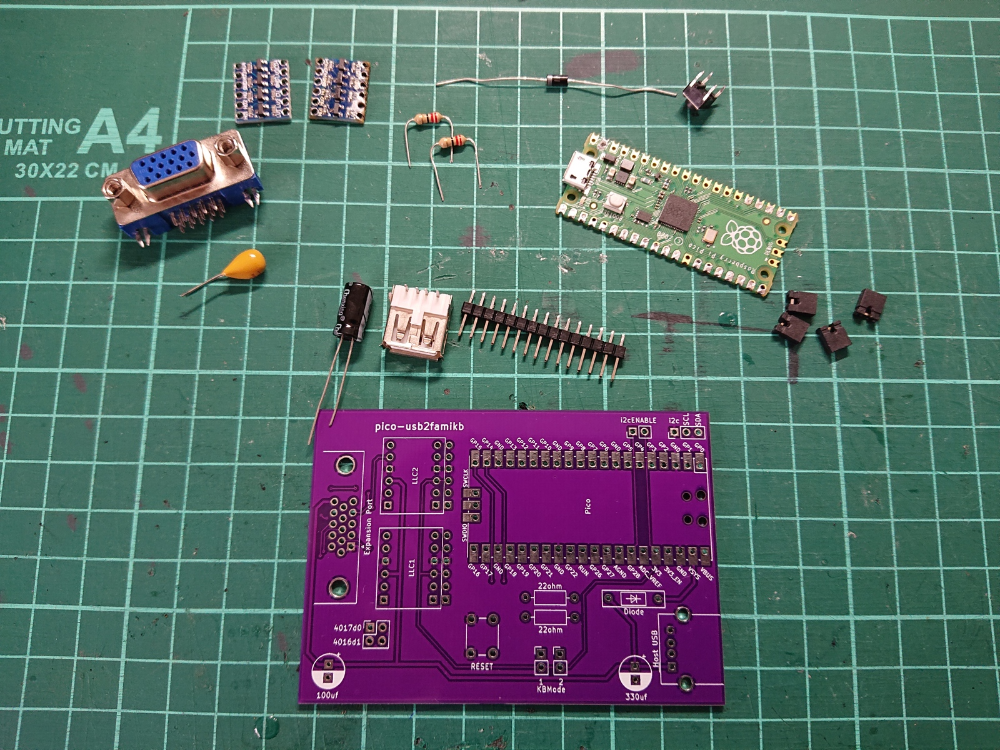
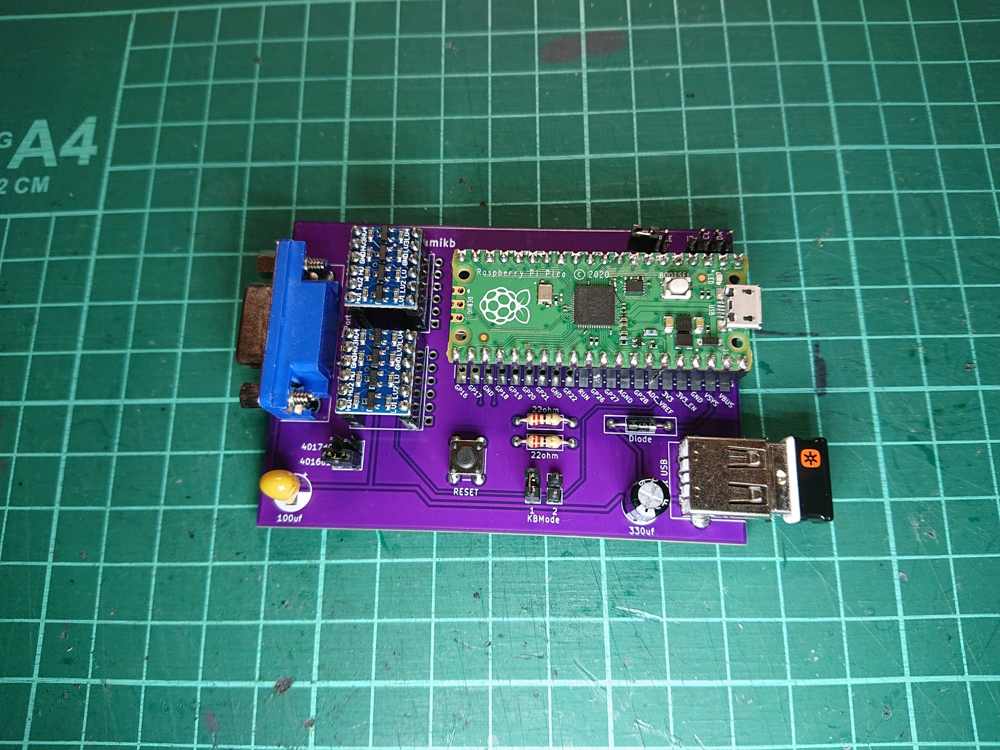

# pico-usb2famikb Reference PCBs
This directory contains reference PCB designs for the pico-usb2famikb. They have not been designed by a experienced engineer, but they DO work.

If you have some experience designing circuits like this, I would very much welcome improved designs.

For the current reference design you will need:
* 1x Raspberry Pi Pico
* 1x diode (I am using a 1N5819)
* 1x push button
* 1x 15pin d-sub VGA connector (for FC expansion port)
* 1x USB A type female port
* 2x 22ohm resistors
* 1x 100uf 16v capacitor (input from console)
* 1x 330uf 16v capacitor
* 2x four-channel logic level converters
* 13x pin headers (and some jumpers)

Note: The 330ohm capactior was added because some USB3 hubs seem to draw significant power on startup can could crash the console or Pico, or both. The USB2 hubs I tested don't seem affected, but you can also just plug everything in before you turn on the console to avoid any issues.